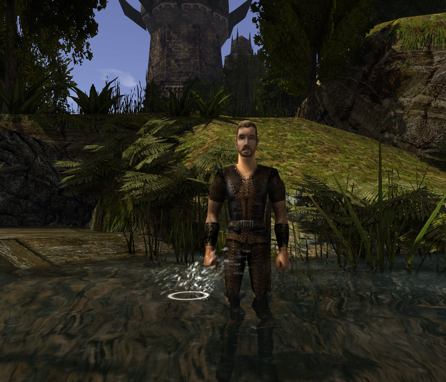

# WaterPhysics - Union Plugin [Gothic I/G1A/G2/G2NotR]

WaterPhysics is a Union plugin for Gothic I/G1A/G2/G2NotR that adds realistic water interaction effects when objects fall into water. This plugin enhances immersion by creating visual and audio feedback for water interactions, making the game world feel more alive and responsive.
https://www.youtube.com/watch?v=U4_CyK9gauM

## Features

- **Dynamic Water Splash Effects**: Objects create realistic splash effects when hitting water surfaces
- **Size-Based Visual Effects**: Different splash intensities based on object size (tiny, small, medium, large)
- **Water Ring Effects**: Expanding ring effects that scale with object size for enhanced realism
- **Audio Feedback**: Contextual water splash sounds that vary by object type and size
- **Full Game Support**: Compatible with Gothic I Classic, Gothic I Addon, Gothic II Classic, and Gothic II NotR

## Installation

1. Download the latest release from the [Releases](../../releases) page
2. Extract `WaterPhysics.vdf` to your `[Gothic]\Data\Plugins` folder
3. Launch Gothic - the plugin will load automatically

## Usage

### Basic Mechanics
- **Object Water Impact**: When any object (items, weapons, arrows, etc.) hits water, it creates splash effects
- **Size Detection**: Plugin automatically detects object size and applies appropriate effects
- **Visual Effects**: Particle-based splash and ring effects that expand and fade naturally
- **Audio Integration**: Water splash sounds synchronized with visual effects

### Effect System
The plugin uses a sophisticated effect system:
- **Tiny Objects**: Minimal splash for arrows, small potions (3x3 ring, light splash)
- **Small Objects**: Moderate effects for keys, regular potions (6x6 ring, medium splash)
- **Medium Objects**: Noticeable splash for weapons, food items (7x7 ring, enhanced splash)
- **Large Objects**: Dramatic effects for armor, shields, large weapons (12x12 ring, intense splash)

## Configuration

WaterPhysics works automatically without configuration. The plugin detects water surfaces and object types automatically, applying appropriate effects based on built-in size categories.

### Technical Details

The plugin automatically:
- Detects when objects enter water surfaces
- Analyzes object size and type
- Spawns appropriate particle effects
- Plays contextual audio feedback
- Manages effect lifecycle for optimal performance

## Building from Source

### Prerequisites
- Visual Studio 2019 or later
- Union SDK v1.0m

### Build Steps
1. Clone this repository
2. Copy ZenGin folder from Union SDK to `WaterPhysics/ZenGin/`
3. Open `WaterPhysics.sln` in Visual Studio
4. Select "MP x4 MT Release" configuration
5. Build the solution
6. Find the compiled DLL in the `Bin/` folder

## Credits

### Development
- **Plugin Author** - WaterPhysics Union implementation
- **Union Team** - For the excellent Union SDK framework
- **Gothic Community** - For continued support and testing

## License

MIT License

## Compatibility

- **Gothic I Classic**: ✅ Supported
- **Gothic I Addon**: ✅ Supported
- **Gothic II Classic**: ✅ Supported  
- **Gothic II NotR**: ✅ Supported
- **The Chronicles Of Myrtana: Archolos**: ✅ Supported
- **Other Mods**: Compatible with most Gothic mods and Union plugins

## Troubleshooting

### Plugin Not Loading
- Ensure `WaterPhysics.vdf` is in the correct folder: `[Gothic]\Data\Plugins`
- Check that Union is properly installed
- Verify Gothic version compatibility

### Effects Not Appearing
- Verify that objects are actually hitting water surfaces
- Check that the water area is properly defined in the game world
- Ensure sufficient system resources for particle effects

### Performance Issues
- The plugin is optimized for performance, but very old systems may experience minor impact
- Effects automatically clean up after completion
- No configuration needed - effects scale appropriately

## Contributing

This is a community project. Feel free to:
- Report bugs in the [Issues](../../issues) section
- Submit improvements via Pull Requests
- Share feedback and suggestions
- Test with different Gothic versions and mods

## Version History

- **v1.0.0** - Initial release
  - Dynamic water splash effects
  - Size-based effect scaling
  - Water ring animations
  - Audio integration
  - Support for all Gothic versions
